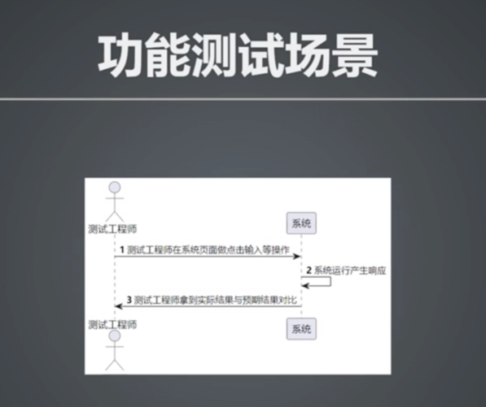
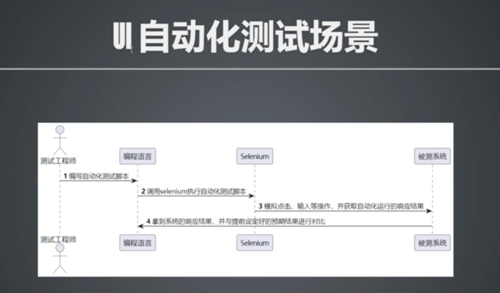
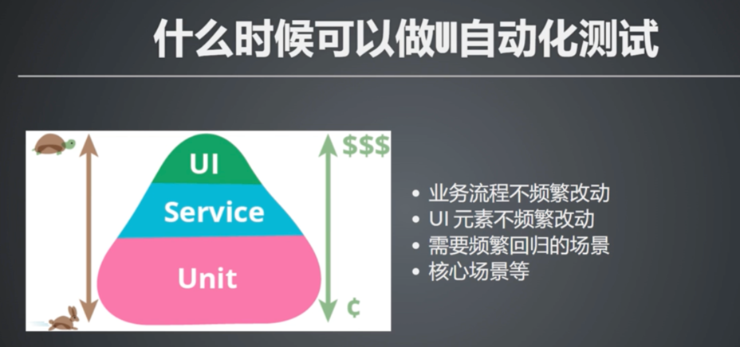
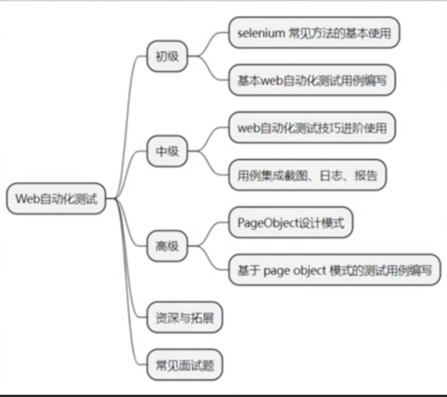
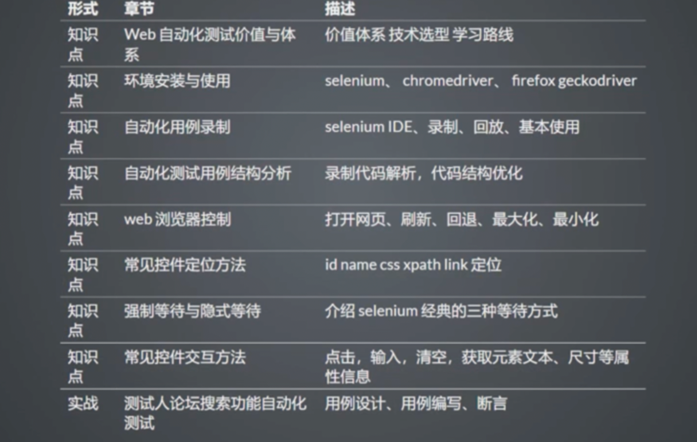
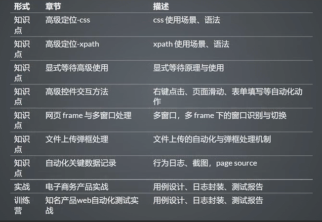
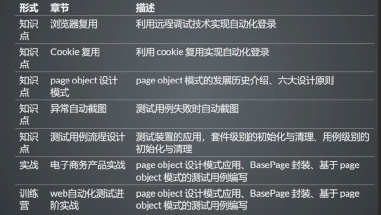
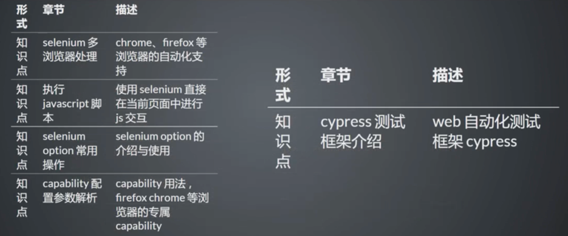
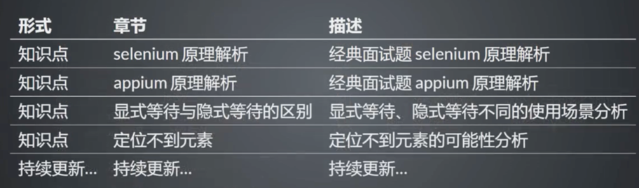

# 一、web自动化测试价值与体系

## web自动化测试的价值

## 为什么要做web自动化测试

### 功能测试场景

### UI自动化测试场景

### 什么时候可以做UI自动化

## web自动化测试相关技术
    Selenium:支持多语言，行业内最火最主流
    Pytest/JUnit5:最好用最全面的单元测试框架
    Allure:测试报告

## Web自动化测试在企业中的实践
    UI自动化测试在有赞的实践：https://ceshiren.com/t/topic/16426

## Web自动化测试学习路线
    由浅入深
    掌握核心和重点
    理论结合实践

## 必修-初级

## 必修-中级

## 必修-高级

## 资深与拓展

## 相关面试题

